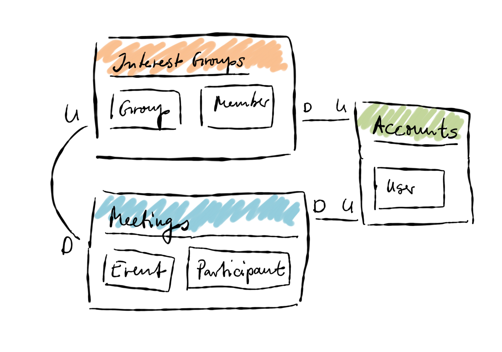

# Domain Design

## Vision Statement

A smart way for collaborative planning and evaluation of meetings with people there sharing collective interests.

### Core-Domains

* **Interest Group** - Manage organizers and members of a meeting.
* **Schedule Event** - Collaborative planing of a meeting in a certain place.

### Sub-Domains

* **Invite** - Invite people into group of interests.
* **Payment** - Payment for a larger group of interests.
* **Feedback** - Review and comment of a meeting in the past.
* **Follow** - Notification of interested people in a group.
* **Suggestion** - Proposal and voting for next meetings.

## Context Map

## Information Architecture

## Services

* **GraphQL API** - Exposes a unified and consistent Domain-API to consume from different customer applications. Publication of all domain relevant aggregates, entities, values objects, domain-commands and domain-events.
* **Meeting Planner** (Web-App) - The primary customer web application for planning and evaluation of meetings.

## Repositories

* **Users** (users.json)
* **Groups** (groups.json)

## Aggregates

* **Viewer** - Root queries within the actual customer context.

## Entities

* **Group** - Represents a collective meeting group.
* **Member** - Represents a member of a meeting group.
* **Account** - Represents an user account.

## Value-Objects

## Domain-Commands

## Domain-Events
